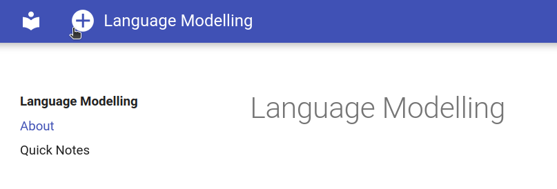
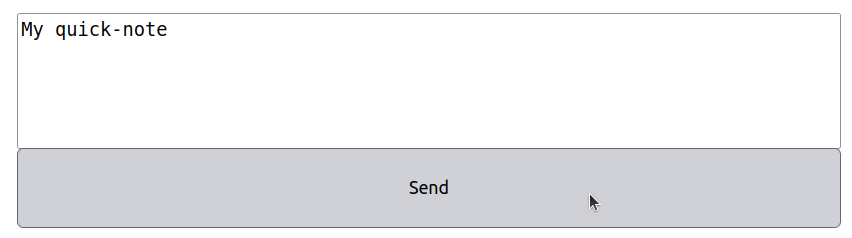
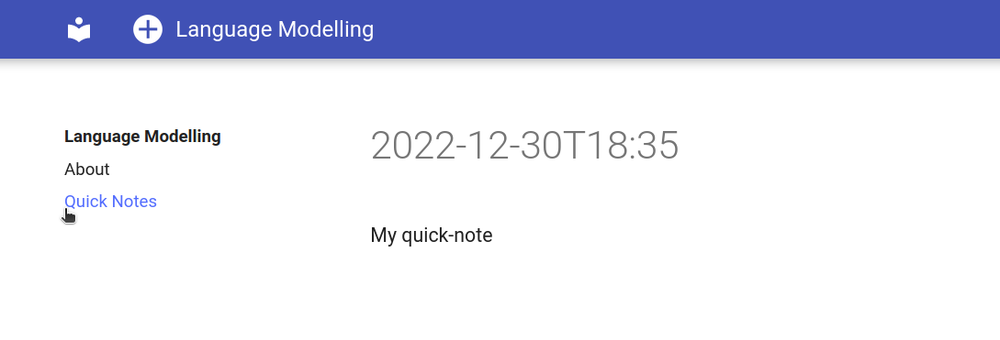
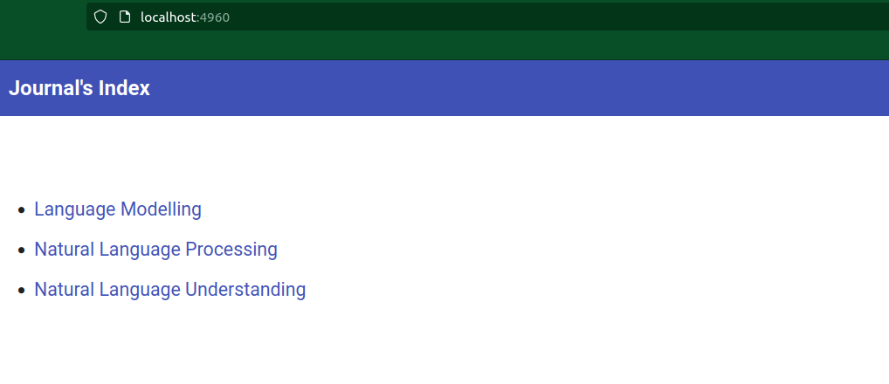

# Journal Manager

Command line interface to manage mkdocs journals

## Features

- Centralized interface: Create, build and edit multiple journals.
- Quick updates: Add a note to your journal from anywhere with quick-notes.
- Journals TOC: Automatically generate a web page with the table of content pointing to your journals.

### Centralized interface

```bash
journal-manager setup init
journal-manager create "Language Modelling"
journal-manager journal edit language-models
journal-manager build --with-http-server language-models
```

### Quick updates

#### Click on the plus sign to add a quick note



#### Enter your quick note in markdown format



#### Visualize all your quick notes in the Quick Notes link




### Journals TOC

A table of content is automatically generates as the index page.



